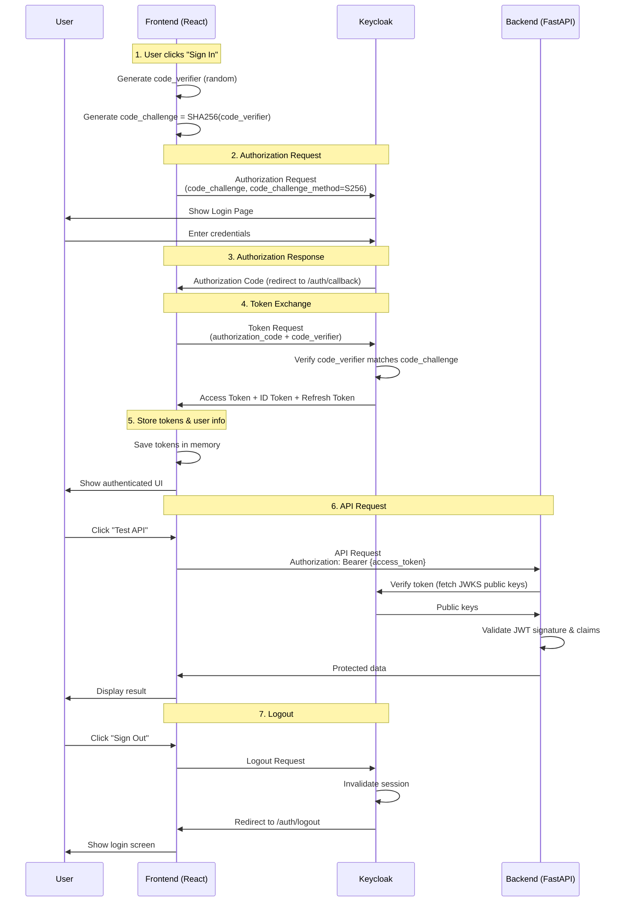

# Keycloak PKCE Authentication with React & FastAPI

A complete authentication solution using Keycloak with PKCE (Proof Key for Code Exchange) flow, featuring a React frontend and FastAPI backend.

## Architecture

```
┌─────────────┐         ┌──────────────┐         ┌─────────────┐
│   React     │         │   Keycloak   │         │   FastAPI   │
│  Frontend   │◄───────►│    Server    │         │   Backend   │
│ (Port 5173) │  HTTPS  │  + Nginx SSL │         │ (Port 8000) │
└─────────────┘         └──────────────┘         └─────────────┘
              (your-keycloak-domain.com)                 ▲
                                                         │
                                                    JWT Token
                                                    Validation
```

##  PKCE Authentication Flow



## 📊 Detailed Authentication Flow

### Phase 1: Initial Login (PKCE)

1. **User Action**: User clicks "Sign In with Keycloak"

2. **Code Challenge Generation** (Frontend):
   ```
   code_verifier = random_string(128 chars)
   code_challenge = BASE64URL(SHA256(code_verifier))
   ```

3. **Authorization Request** (Frontend → Keycloak):
   ```
   GET https://your-keycloak-domain.com/realms/your-realm/protocol/openid-connect/auth
   Parameters:
   - client_id: your-client-id
   - redirect_uri: http://localhost:5173/auth/callback
   - response_type: code
   - scope: openid profile email
   - code_challenge: {generated_challenge}
   - code_challenge_method: S256
   ```

4. **User Authentication** (Keycloak):
   - User enters username/password
   - Keycloak validates credentials
   - Keycloak stores code_challenge

5. **Authorization Code** (Keycloak → Frontend):
   ```
   Redirect: http://localhost:5173/auth/callback?code={auth_code}
   ```

6. **Token Exchange** (Frontend → Keycloak):
   ```
   POST https://your-keycloak-domain.com/realms/your-realm/protocol/openid-connect/token
   Body:
   - grant_type: authorization_code
   - code: {auth_code}
   - redirect_uri: http://localhost:5173/auth/callback
   - client_id: your-client-id
   - code_verifier: {original_verifier}
   ```

7. **Token Response** (Keycloak → Frontend):
   ```json
   {
     "access_token": "eyJhbGci...",
     "token_type": "Bearer",
     "expires_in": 300,
     "refresh_token": "eyJhbGci...",
     "id_token": "eyJhbGci..."
   }
   ```

### Phase 2: API Requests

1. **Frontend stores** access token in memory (AuthContext)

2. **API Call** (Frontend → Backend):
   ```
   GET /api/protected
   Headers:
   - Authorization: Bearer {access_token}
   ```

3. **Token Validation** (Backend):
   - Extract token from Authorization header
   - Fetch Keycloak's public keys (JWKS)
   - Verify JWT signature using RS256
   - Validate claims:
     * `iss` (issuer): https://your-keycloak-domain.com/realms/your-realm
     * `aud` (audience): account
     * `exp` (expiration): not expired
     * `iat` (issued at): valid time

4. **Response** (Backend → Frontend):
   ```json
   {
     "message": "Protected data",
     "user": {
       "sub": "user-id",
       "email": "user@example.com"
     }
   }
   ```

### Phase 3: Token Refresh (Automatic)

1. **Token Expiration Check** (Frontend):
   - oidc-client-ts monitors token expiration
   - Triggers silent renewal 60 seconds before expiry

2. **Silent Refresh** (Frontend → Keycloak):
   ```
   POST https://your-keycloak-domain.com/realms/your-realm/protocol/openid-connect/token
   Body:
   - grant_type: refresh_token
   - refresh_token: {refresh_token}
   - client_id: your-client-id
   ```

3. **New Tokens** (Keycloak → Frontend):
   - New access_token
   - New refresh_token
   - Updated in AuthContext

### Phase 4: Logout

1. **User Action**: User clicks "Sign Out"

2. **Logout Request** (Frontend → Keycloak):
   ```
   GET https://your-keycloak-domain.com/realms/your-realm/protocol/openid-connect/logout
   Parameters:
   - id_token_hint: {id_token}
   - post_logout_redirect_uri: http://localhost:5173/auth/logout
   ```

3. **Session Cleanup** (Keycloak):
   - Invalidate session
   - Clear cookies

4. **Redirect** (Keycloak → Frontend):
   - Redirect to /auth/logout
   - Frontend clears tokens
   - Show login screen

### JWT Token Validation
- **Algorithm**: RS256 (asymmetric encryption)
- **Public Key**: Fetched from Keycloak JWKS endpoint
- **Claims Verified**:
  - Signature (cryptographic validation)
  - Issuer (prevents token from other sources)
  - Audience (ensures token is for this API)
  - Expiration (prevents old token reuse)
  - Issued At (prevents pre-dated tokens)

### CORS Protection
- Backend only accepts requests from `http://localhost:5173`
- Credentials included in requests
- Specific methods and headers allowed

### Token Storage
- **Access Token**: Stored in memory (AuthContext)
- **Not in localStorage**: Prevents XSS attacks
- **Auto-refresh**: Silent renewal before expiration

## Quick Start

### Prerequisites
- Node.js 18+
- Python 3.9+
- Keycloak server running (see [docker-keycloak/ReadMe.md](docker-keycloak/ReadMe.md) for setup)
- SSL certificates configured for production (see [docker-keycloak/ReadMe.md](docker-keycloak/ReadMe.md))

### Configuration

Before starting, you need to configure your Keycloak connection details:

1. **Frontend Configuration**:
   ```bash
   cd frontend
   cp .env.example .env
   # Edit .env and set your Keycloak URL, realm, and client ID
   ```

2. **Backend Configuration**:
   ```bash
   cd backend
   cp .env.example .env
   # Edit .env and set your Keycloak URL and realm
   ```

3. **Keycloak Docker Configuration**:
   - Edit `docker-keycloak/docker-compose.yml`
   - Update `KC_HOSTNAME` with your domain
   - Update `KEYCLOAK_ADMIN_PASSWORD` with a secure password

### 1. Frontend Setup

```bash
cd frontend
npm install
npm run dev
```

Access at: http://localhost:5173

### 2. Backend Setup

```bash
cd backend
python -m venv venv
source venv/bin/activate
pip install -r requirements.txt
python main.py
```

API available at: http://localhost:8000
API Docs: http://localhost:8000/docs

### 3. Keycloak Configuration

**Client Settings** (configure in Keycloak Admin Console):
- Client Protocol: openid-connect
- Access Type: Public
- Standard Flow: ON
- Valid Redirect URIs:
  - `http://localhost:5173/auth/callback`
  - `http://localhost:5173/*`
- Valid Post Logout Redirect URIs:
  - `http://localhost:5173/auth/logout`
  - `http://localhost:5173/`
- Web Origins: `http://localhost:5173`
- PKCE Code Challenge Method: S256

For detailed Keycloak setup instructions, see [docker-keycloak/ReadMe.md](docker-keycloak/ReadMe.md).

## 📁 Project Structure

```
.
├── frontend/                 # React application
│   ├── src/
│   │   ├── auth/
│   │   │   ├── authConfig.ts      # OIDC configuration
│   │   │   ├── AuthContext.tsx    # Auth provider & hooks
│   │   │   ├── AuthCallback.tsx   # OAuth callback handler
│   │   │   └── LogoutCallback.tsx # Logout handler
│   │   ├── components/
│   │   │   ├── ApiTestPage.tsx    # API testing interface
│   │   │   └── ui/                # Chakra UI components
│   │   ├── services/
│   │   │   └── api.ts             # API client with axios & auth
│   │   ├── App.tsx                # Main app component
│   │   └── main.tsx               # App entry point
│   └── package.json
│
├── backend/                  # FastAPI application
│   ├── main.py               # API server with JWT validation
│   ├── requirements.txt      # Python dependencies
│   └── README.md            # Backend documentation
│
└── README.md                # This file
```

## 📚 API Endpoints

### Public Endpoints
- `GET /` - Welcome message
- `GET /health` - Health check

### Protected Endpoints (Require JWT)
- `GET /api/protected` - Basic protected route
- `GET /api/user/profile` - Current user profile
- `GET /api/user/roles` - User roles and permissions
- `POST /api/data` - Create data (example)
- `GET /api/admin/users` - Admin only (requires 'admin' role)

## 🔍 Testing the Flow

1. **Start both servers**:
   - Frontend: http://localhost:5173
   - Backend: http://localhost:8000

2. **Login**:
   - Click "Sign In with Keycloak"
   - Enter credentials in Keycloak
   - Redirected back with tokens

3. **Test API**:
   - Click "Test API" button
   - Try different endpoints
   - Observe token in Authorization header (axios automatically adds it)

4. **Logout**:
   - Click "Sign Out"
   - Session cleared in Keycloak
   - Tokens removed from frontend
